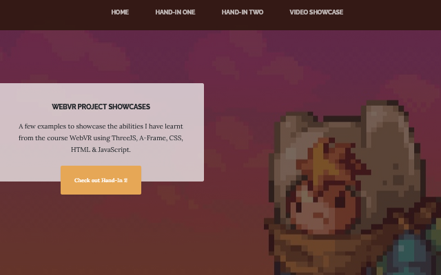

# WebVR: Nightmare Before Christmas & Pokémon

Utilizing the [Business Casual](https://startbootstrap.com/theme/business-casual/) theme by [Bootstrap](https://getbootstrap.com/), I have created the webpage containing these hand-ins to showcase my abilities with primarily A-Frame (version 1.04) and some web developing.

## Preview

  

  
  

## Limitations
Projects were only tested on PC and Oculus Quest, and may not work well for other devices.  
Tested on Firefox and Chrome, works best with the latter.

## Download and Installation
To get these A-frame projects:

* Clone the repo: `git clone https://github.com/Avalin/Hand_Ins.git`

That's it.

## Usage
Using [OpenSSL](https://github.com/openssl/openssl) and [http-server](https://github.com/http-party/http-server), I use this command:

* http-server -S -C cert.pem -o

To run the project on my local network and have it accessible on other devices, i.e. Oculus Quest.  
Personal note: ngrok can be used to share with others as a temporary solution.

## Bugs and Issues
Projects were only tested on PC and Oculus Quest, and may not work as intended with other devices.

### Hand-In 1:
- Camera has a "boaty" movement
- 3D model shader problems on all animated characters (I'm no 3D artist, and had to give up attempting to fix this)

### Hand-In 2: 
- Camera height at spawn vs camera height when teleporting issue
- Not all Oculus Quest button component registers/works? i.e. I could not make a component for when using the thumbstick
- Sounds not always working on Firefox (Probably an A-frame related issue)

## Copyright and License

Don't use this for commercial purposes. I don't personally care, but Nintendo or Disney might.
